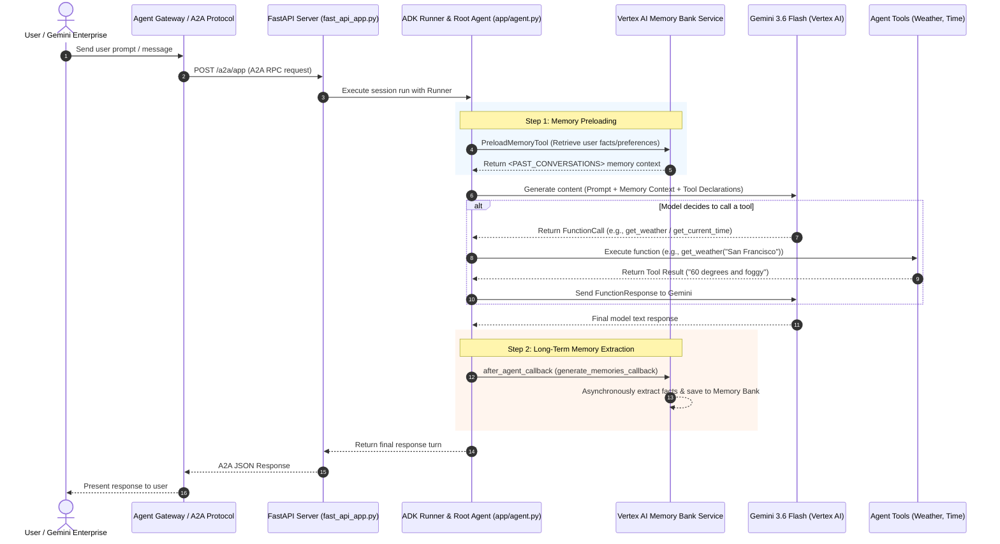

# Personal Assistant Agent (`personal-assistant`)

A production-ready personalized AI assistant built with the **Google Agent Development Kit (ADK)** and deployed on **Google Cloud Platform (GCP)**. It features persistent long-term memory extraction via **Vertex AI Memory Bank**, real-time simulated tools (weather, time), and Agent-to-Agent (A2A) protocol support for enterprise integration.

---

## 🌟 Key Features & Capabilities

- **Warm & Personable Conversational Persona**: Maintains an engaging, helpful tone, acknowledges introductions, and addresses users by name.
- **Persistent Long-Term Memory**: Automatically extracts, stores, and preloads user facts and preferences across sessions using Vertex AI Memory Bank.
- **Real-time Tool Execution**: Includes function declarations for retrieving current weather and time information.
- **Agent-to-Agent (A2A) Protocol**: Built-in FastAPI endpoints supporting A2A inter-agent communication.
- **Enterprise Ready**: Fully deployed to Vertex AI Agent Runtime and integrated with Gemini Enterprise App & Agent Gateway.

---

## 🔄 Agent Workflow Architecture

The following diagram illustrates how user requests flow through the Gemini Enterprise / Agent Gateway layer, the FastAPI server, the ADK Root Agent, and underlying GCP Vertex AI services.



---

## ☁️ Google Cloud Services Used

| Google Cloud Service | Component / File | Purpose & Role |
| :--- | :--- | :--- |
| **Vertex AI Agent Engine (Reasoning Engine)** | [`deployment_metadata.json`](deployment_metadata.json) | Managed cloud runtime that hosts and runs the agent container in `us-central1`. |
| **Vertex AI Memory Bank Service** | [`app/app_utils/services.py`](app/app_utils/services.py) | Stores extracted long-term memories (user preferences, facts) across deployments. |
| **Vertex AI Session Service** | [`app/app_utils/services.py`](app/app_utils/services.py) | Manages multi-turn conversation sessions persistently. |
| **Gemini 3.6 Flash (`gemini-3.6-flash`)** | [`app/agent.py`](app/agent.py) | Core Large Language Model for reasoning, text generation, and function calling. |
| **Gemini Enterprise & Agent Gateway** | User Defined | Exposes the agent to enterprise chat apps and gateways. |
| **Cloud Logging & OpenTelemetry** | [`app/fast_api_app.py`](app/fast_api_app.py) | Structured logging, error collection, and open-telemetry tracing in GCP Console. |

---

## 📋 Requirements & Prerequisites

### System Requirements
- **Python**: `3.12` or higher
- **Package Manager**: [`uv`](https://astral.sh/uv) (recommended)
- **Google Cloud SDK**: `gcloud` CLI installed and authenticated

### Google Cloud Permissions
Your GCP identity / Service Account requires the following IAM roles:
- `roles/aiplatform.user` (Vertex AI Agent Engine & Gemini model access)
- `roles/logging.logWriter` (Cloud Logging)
- `roles/storage.objectAdmin` (if storing artifacts in GCS)

---

## 🚀 Local Development & Running

### 1. Environment Configuration

Copy the example environment file and fill in your GCP project details:
```bash
cp .env.example .env
```

`.env` example content:
```env
GOOGLE_CLOUD_PROJECT=<YOUR_PROJECT_ID>
GOOGLE_CLOUD_LOCATION=us-central1
GOOGLE_GENAI_USE_VERTEXAI=true
MODEL_NAME=gemini-3.6-flash
```

### 2. Install Dependencies
```bash
uv sync --dev
```

### 3. Run Local Agent Playground
Launch the interactive web-based Agent Playground locally using `uv run` (to ensure SSL certificates and virtualenv dependencies are loaded):
```bash
uv run agents-cli playground
```
This opens an interactive local chat interface in your browser at `http://127.0.0.1:8080` to interact with the agent, test tool calls, and inspect session state.


---

## 🧪 Testing & Evaluation

### Run Test Suite
Run unit, integration, and server E2E tests:
```bash
uv run pytest
```

### Run Evaluation Benchmarks
Run multi-turn quality and task success evaluations using `google-agents-cli`:
```bash
agents-cli eval run
```
View evaluation results generated in `artifacts/grade_results/`.

---

## 🚢 Deployment Guide

### Deploy to Vertex AI Agent Runtime
Deploy the agent using `agents-cli`:
```bash
agents-cli deploy --no-confirm-project
```

### Register with Gemini Enterprise
Publish the deployed agent to your Gemini Enterprise App:
```bash
agents-cli publish gemini-enterprise \
  --app-id "projects/<YOUR_PROJECT_NUMBER>/locations/us/collections/default_collection/engines/<YOUR_APP_ID>" \
  --agent-gateway "projects/<YOUR_PROJECT_NUMBER>/locations/<LOCATION>/gateways/<YOUR_AGENT_GATEWAY_NAME>"
```
