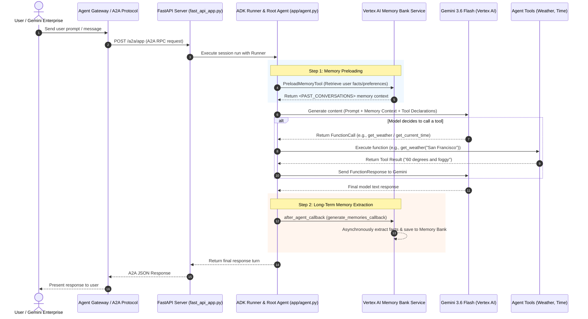

# Personal Assistant Agent (`personal-assistant`)

> [!IMPORTANT]
> **Disclaimer & Usage Notice**: This repository and its sample code are provided "as-is" for educational and demonstration purposes, without warranty or liability of any kind. Executing, testing, or deploying these agents may incur Google Cloud Platform (GCP) charges (such as Vertex AI API calls, Reasoning Engine deployments, or Memory Bank usage). Please monitor your GCP billing dashboard and resource usage accordingly.

An experimental personalized AI assistant built with the **Google Agent Development Kit (ADK)** and deployed on **Google Cloud Platform (GCP)**. It features persistent long-term memory extraction via **Vertex AI Memory Bank**, real-time simulated tools (weather, time), and Agent-to-Agent (A2A) protocol support for enterprise integration.

---

## 🌟 Key Features & Capabilities

- **Warm & Personable Conversational Persona**: Maintains an engaging, helpful tone, acknowledges introductions, and addresses users by name.
- **Persistent Long-Term Memory**: Automatically extracts, stores, and preloads user facts and preferences across sessions using Vertex AI Memory Bank.
- **Real-time Tool Execution**: Includes function declarations for retrieving current weather and time information.
- **Agent-to-Agent (A2A) Protocol**: Built-in FastAPI endpoints supporting A2A inter-agent communication.
- **Enterprise Ready**: Fully deployed to Vertex AI Agent Runtime and integrated with Gemini Enterprise App & Agent Gateway.
- **Multi-User Workshop Ready**: Includes a dedicated [Workshop Deployment Guide](WORKSHOP.md) for running multi-user hands-on labs without agent naming collisions.

---

## 🔄 Agent Workflow Architecture

The following diagram illustrates how user requests flow through the Gemini Enterprise / Agent Gateway layer, the FastAPI server, the ADK Root Agent, and underlying GCP Vertex AI services.



---

## ☁️ Google Cloud Services Used

| Google Cloud Service | Component / File | Purpose & Role |
| :--- | :--- | :--- |
| **Vertex AI Agent Engine (Reasoning Engine)** | [`deployment_metadata.json`](deployment_metadata.json) | Managed cloud runtime that hosts and runs the agent container in `us-central1`. |
| **Google Cloud Model Armor** | [`app/app_utils/model_armor_plugin.py`](app/app_utils/model_armor_plugin.py) | Security screening service protecting prompts and LLM outputs against prompt injection, jailbreaks, PII leakage, CSAM, and malicious URLs. |
| **Vertex AI Memory Bank Service** | [`app/app_utils/services.py`](app/app_utils/services.py) | Stores extracted long-term memories (user preferences, facts) across deployments. |
| **Vertex AI Session Service** | [`app/app_utils/services.py`](app/app_utils/services.py) | Manages multi-turn conversation sessions persistently. |
| **Gemini 3.6 Flash (`gemini-3.6-flash`)** | [`app/agent.py`](app/agent.py) | Core Large Language Model for reasoning, text generation, and function calling. |
| **Gemini Enterprise & Agent Gateway** | User Defined | Exposes the agent to enterprise chat apps and gateways. |
| **Cloud Logging & OpenTelemetry** | [`app/fast_api_app.py`](app/fast_api_app.py) | Structured logging, error collection, and open-telemetry tracing in GCP Console. |

---

## 📋 Requirements & Prerequisites

### System Requirements
- **Python**: `3.12` or higher
- **Package Manager**: [`uv`](https://astral.sh/uv) (recommended)
- **Google Cloud SDK**: `gcloud` CLI installed and authenticated
- **Google Antigravity (`agy`)**: (Optional but recommended)
  - **Desktop App**: Download from [antigravity.google/download](https://antigravity.google/download)
  - **Antigravity CLI**: `uv tool install agy` (launch with `agy` in terminal)
- **Google Agents CLI (`agents-cli`)**: `uv tool install google-agents-cli` (then run `agents-cli setup` to auto-install ADK skills)

### Google Cloud Permissions
Your GCP identity / Service Account requires the following IAM roles:
- `roles/aiplatform.user` (Vertex AI Agent Engine & Gemini model access)
- `roles/logging.logWriter` (Cloud Logging)
- `roles/storage.objectAdmin` (if storing artifacts in GCS)

---

## 🚀 Local Development & Running

### 1. Environment Configuration

Copy the example environment file and fill in your GCP project details:
```bash
cp .env.example .env
```

`.env` example content:
```env
GOOGLE_CLOUD_PROJECT=<YOUR_PROJECT_ID>
GOOGLE_CLOUD_LOCATION=us-central1
GOOGLE_GENAI_USE_VERTEXAI=true
MODEL_NAME=gemini-3.6-flash
```

### 2. Install Dependencies
```bash
uv sync --dev
```

### 3. Run Local Agent Playground
Launch the interactive web-based Agent Playground locally using `uv run` (to ensure SSL certificates and virtualenv dependencies are loaded):
```bash
uv run agents-cli playground
```
This opens an interactive local chat interface in your browser at `http://127.0.0.1:8080` to interact with the agent, test tool calls, and inspect session state.


---

## 🧪 Testing & Evaluation

### Run Test Suite
Run unit, integration, and server E2E tests:
```bash
uv run pytest
```

### Run Evaluation Benchmarks
Run multi-turn quality and task success evaluations using `google-agents-cli`:
```bash
agents-cli eval run
```
View evaluation results generated in `artifacts/grade_results/`.

---

## 🚢 Deployment & Integration Guide

### 1. Local Testing (No Cloud Setup Required)
You do **not** need an Agent Gateway or GCP deployment to test and develop locally.
Simply run:
```bash
uv run agents-cli playground
```
This opens an interactive local chat interface at `http://127.0.0.1:8080`.

---

### 2. Deploy to Vertex AI Agent Engine (Reasoning Engine)
To host the agent on managed Google Cloud infrastructure:

1. **Enable Vertex AI API**:
   ```bash
   gcloud services enable aiplatform.googleapis.com --project=<YOUR_PROJECT_ID>
   ```
2. **Deploy the Agent**:
   ```bash
   agents-cli deploy --no-confirm-project
   ```
   Upon completion, `agents-cli` outputs your **Reasoning Engine Resource ID** (e.g. `projects/<PROJECT_NUMBER>/locations/us-central1/reasoningEngines/<ENGINE_ID>`).

---

### 3. Optional: Agent Gateway & Gemini Enterprise Setup

If you want to integrate your deployed agent with **Gemini Enterprise** or **Agent Gateway**, follow these setup steps:

#### Prerequisites
- A Google Cloud Project with **Gemini Enterprise** (formerly Vertex AI Search and Conversation / Agent Builder) enabled.
- An existing Gemini Enterprise App/Engine. You can find your App ID in the [Vertex AI Search & Conversation Console](https://console.cloud.google.com/gen-app-builder/engines).

#### Step 1: Create an Agent Gateway (Using REST API / `gcloud`)
1. **Enable the Network Services API**:
   ```bash
   gcloud services enable networkservices.googleapis.com --project=<YOUR_PROJECT_ID>
   ```

2. **Create an Agent Gateway Instance via `curl` REST API**:
   ```bash
   curl -X POST \
     -H "Authorization: Bearer $(gcloud auth print-access-token)" \
     -H "Content-Type: application/json" \
     "https://networkservices.googleapis.com/v1/projects/<YOUR_PROJECT_ID>/locations/<YOUR_LOCATION>/agentGateways?agentGatewayId=<YOUR_GATEWAY_NAME>" \
     -d '{
       "googleManaged": {
         "governedAccessPath": "AGENT_TO_ANYWHERE"
       }
     }'
   ```

3. **Check Creation Completion Status**:
   Creating an Agent Gateway is an asynchronous Long-Running Operation (LRO). You can poll the operation status using the returned operation path:
   ```bash
   curl -H "Authorization: Bearer $(gcloud auth print-access-token)" \
     "https://networkservices.googleapis.com/v1/projects/<YOUR_PROJECT_ID>/locations/<YOUR_LOCATION>/operations/<OPERATION_ID>"
   ```
   Or list your active Agent Gateways once provisioning completes (usually 1-3 minutes):
   ```bash
   gcloud network-services agent-gateways list --location=<YOUR_LOCATION>
   ```

4. **Obtain Gateway Resource Path**:
   Your created Agent Gateway resource path follows this format:
   `projects/<YOUR_PROJECT_NUMBER>/locations/<YOUR_LOCATION>/agentGateways/<YOUR_GATEWAY_NAME>`

#### Step 2: Publish Agent to Gemini Enterprise
Register your deployed agent with your Gemini Enterprise App.

##### Option A: Interactive Discovery Mode (Recommended for simplicity/learning, not programmatic)
Launch the interactive wizard to automatically discover your local deployment metadata and select from your existing Gemini Enterprise apps:
```bash
agents-cli publish gemini-enterprise --interactive
```

##### Option B: Programmatic Mode
If running in automated CI/CD pipelines, first list your available Gemini Enterprise Apps to get the full resource name (`--gemini-enterprise-app-id`):

1. **List Gemini Enterprise Apps**:
   ```bash
   agents-cli publish gemini-enterprise --list --project-id <YOUR_PROJECT_ID>
   ```

2. **Publish Agent**:
   ```bash
   agents-cli publish gemini-enterprise \
     --project-id "<YOUR_PROJECT_ID>" \
     --gemini-enterprise-app-id "projects/<YOUR_PROJECT_NUMBER>/locations/<LOCATION>/collections/default_collection/engines/<YOUR_APP_ENGINE_ID>"
   ```

> [!IMPORTANT]
> - Do **not** pass your Reasoning Engine ID (e.g., numeric string `719...`) as `--gemini-enterprise-app-id`. The `--gemini-enterprise-app-id` flag requires the Gemini Enterprise App engine name (`engines/<YOUR_APP_ENGINE_ID>`).
> - Gemini Enterprise Apps are typically hosted in multi-region locations (e.g., `locations/us` or `locations/global`), whereas Reasoning Engines are hosted in specific regions (e.g., `locations/us-central1`). Verify the correct location using `agents-cli publish gemini-enterprise --list`.

---

## 🛡️ Security & Model Armor Integration (Optional)

To protect your agent against **prompt injection, jailbreaks, PII/sensitive data leakage, CSAM, and malicious URLs**, Google Cloud Model Armor is configured at both the Gemini Enterprise App level and the ADK Agent Runtime level.

### 1. Gemini Enterprise App Model Armor Configuration

Model Armor templates define security policies (e.g. prompt injection detection, jailbreak filters, malicious URLs, CSAM, sensitive PII leakage).

#### How Model Armor Templates are Generated and Updated in GCP:

> [!IMPORTANT]
> **Model Armor Location Selection (`us` vs `eu`)**:
> - Model Armor uses GCP **multi-region locations**—specifically **`us`** and **`eu`**. It is **not** available in the `global` region.
> - **Gemini Enterprise Alignment**: Your Model Armor template location must match the multi-region of your Gemini Enterprise App:
>   - **US Gemini App** → Use location **`us`** (`https://modelarmor.us.rep.googleapis.com/`)
>   - **EU Gemini App** → Use location **`eu`** (`https://modelarmor.eu.rep.googleapis.com/`)

You can generate and upload Model Armor templates to GCP using **3 different methods**:

##### Method 1: Google Cloud CLI (`gcloud`)
1. **Enable Model Armor API**:
   ```bash
   gcloud services enable modelarmor.googleapis.com --project=<YOUR_PROJECT_ID>
   ```

2. **Set Multi-Region API Endpoint Override**:
   Configure `gcloud` to use the endpoint for your Model Armor multi-region (`us` or `eu`):
   ```bash
   # For US multi-region:
   gcloud config set api_endpoint_overrides/modelarmor "https://modelarmor.us.rep.googleapis.com/"

   # For EU multi-region:
   # gcloud config set api_endpoint_overrides/modelarmor "https://modelarmor.eu.rep.googleapis.com/"
   ```

3. **Generate & Upload Template**:
   ```bash
   gcloud model-armor templates create <YOUR_TEMPLATE_ID> \
     --project=<YOUR_PROJECT_ID> \
     --location=us \
     --rai-settings-filters='[
       {"filterType": "HATE_SPEECH", "confidenceLevel": "MEDIUM_AND_ABOVE"},
       {"filterType": "HARASSMENT", "confidenceLevel": "MEDIUM_AND_ABOVE"},
       {"filterType": "DANGEROUS", "confidenceLevel": "MEDIUM_AND_ABOVE"},
       {"filterType": "SEXUALLY_EXPLICIT", "confidenceLevel": "MEDIUM_AND_ABOVE"}
     ]' \
     --pi-and-jailbreak-filter-settings-enforcement=enabled \
     --pi-and-jailbreak-filter-settings-confidence-level=high \
     --malicious-uri-filter-settings-enforcement=enabled
   ```

##### Method 2: Programmatic REST API / `curl`
You can generate templates via REST API request using the `us` or `eu` multi-region endpoint:
```bash
curl -X POST \
  -H "Authorization: Bearer $(gcloud auth print-access-token)" \
  -H "Content-Type: application/json" \
  "https://modelarmor.us.rep.googleapis.com/v1/projects/<YOUR_PROJECT_ID>/locations/us/templates?templateId=<YOUR_TEMPLATE_ID>" \
  -d '{
    "filterConfig": {
      "piAndJailbreakFilterSettings": {
        "filterEnforcement": "ENABLED",
        "confidenceLevel": "HIGH"
      },
      "maliciousUriFilterSettings": {
        "filterEnforcement": "ENABLED"
      },
      "raiSettings": {
        "raiFilters": [
          { "filterType": "HATE_SPEECH", "confidenceLevel": "MEDIUM_AND_ABOVE" },
          { "filterType": "HARASSMENT", "confidenceLevel": "MEDIUM_AND_ABOVE" },
          { "filterType": "DANGEROUS", "confidenceLevel": "MEDIUM_AND_ABOVE" },
          { "filterType": "SEXUALLY_EXPLICIT", "confidenceLevel": "MEDIUM_AND_ABOVE" }
        ]
      }
    }
  }'
```

##### Method 3: Google Cloud Console UI
1. Navigate to **Gemini Enterprise > Security > Configuration**:
   `https://console.cloud.google.com/gemini-enterprise/locations/<YOUR_LOCATION>/engines/<YOUR_APP_ID>/security/configuration?project=<YOUR_PROJECT_ID>`
2. Click **Create Security Template** or **Configure Model Armor**.
3. Select desired security policies:
   - **Prompt Injection & Jailbreak**: High confidence
   - **Malicious URLs**: Enabled
   - **Responsible AI Safety Filters** (`MEDIUM_AND_ABOVE`): Hate Speech, Harassment, Dangerous Content, Sexually Explicit
4. Click **Save**. GCP generates the template resource automatically.

#### Attaching the Template to Gemini Enterprise:
Once the template is generated in GCP, copy its full resource path:
```text
projects/<YOUR_PROJECT_ID>/locations/<YOUR_LOCATION>/templates/<YOUR_TEMPLATE_ID>
```
In the [Gemini Enterprise Security Console](https://console.cloud.google.com/gemini-enterprise/locations/<YOUR_LOCATION>/engines/<YOUR_APP_ID>/security/configuration?project=<YOUR_PROJECT_ID>), select this template for both **User Prompt Template** and **Response Template** and click **Save**.

### 2. ADK Plugin Backend Protection (`ModelArmorPlugin`)

The ADK agent runtime incorporates [`ModelArmorPlugin`](app/app_utils/model_armor_plugin.py) via ADK `BasePlugin`. 

To enable Model Armor backend sanitization during local agent execution, copy `.env.example` to `.env` and configure the Model Armor section:

- **Environment Variables (`.env`)**:
  ```env
  MODEL_ARMOR_PROJECT_ID=<YOUR_PROJECT_ID>
  MODEL_ARMOR_LOCATION=us
  MODEL_ARMOR_TEMPLATE_ID=<YOUR_TEMPLATE_ID>
  MODEL_ARMOR_STRICT_MODE=false
  ```

- **Runtime Behavior**:
  - `before_model_callback`: Calls `SanitizeUserPrompt` to inspect incoming user prompts before they reach Gemini.
  - `after_model_callback`: Calls `SanitizeModelResponse` to inspect outgoing model responses before returning to the client.
  - **Graceful Fallback**: If these variables are omitted or commented out in `.env`, the plugin gracefully bypasses inspection with a log notice, allowing local offline development without requiring Model Armor.

